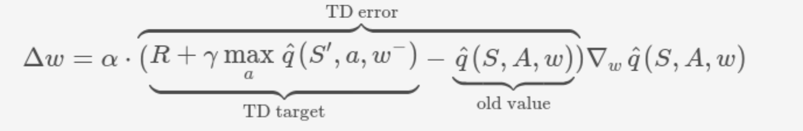
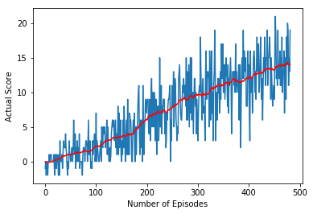
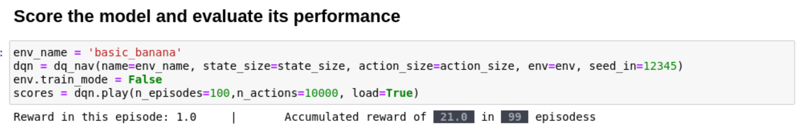

# Deep Reinforcement Learning: Project 1 - Navigation


## Getting started
Please click and follow [these instructions](https://github.com/udacity/deep-reinforcement-learning/tree/master/p1_navigation).

## Source Code
All of the python components of the project are included in a single notebook:
* `Navigation.ipynb`: contains all python code needed to train and play with the agent including:
    * Agent class
    * Neural Network Architecture definition (model)
    * Replay Memory Class
    * Main Driver Class
    * Plotting and reporting calls 

Apart from the source code the following files are necessary and hence are included with the project:
* `nav_checkpoint.pth`: The trained network, necessary for scoring an environment without training.
* `./Banana_Linux/Banana.x86*`: The linux version of the Unity environment on which the agent is trained.

The [DQN](https://github.com/udacity/deep-reinforcement-learning/tree/master/dqn) practice project has been used as the base of this project (as advised in the project instructions).

### Training Algorithm
There are several components in the training algorithm:

1. **Replay Buffer**. *Experience tuples* `(S, A, R, S', done)` namely `state`, `action`, `reward`, `next_state` and `done` are gathered in batches with the defined size. This buffer is used to train the agent by random sampling (area for improvement). The implementation is identical to what was provided in the [DQN](https://github.com/udacity/deep-reinforcement-learning/tree/master/dqn) practice project.

2. **TD Learning**. The TD learning algorithm is used to update the neural network parameters. Namely, we hope for each experience tuple `(S, A, R, S', done)`, the Q score `Q(S, A)` can be closed to the following TD-target
    
        TD-target = Reward + GAMMA * argmax Q(S', a) * (1-dones) 
    

3. **Fixed Q-Targets**. Two DQNs are used to decouple the dependency of the gradient computation from the next Q estimation a concept that was discussed in the class. This is achieved by using two networks, `qn_local` and `qn_target` with different weights. The following two expressions are key to the implementation (from the `learn` method in `qn_agent` class):
                        

    

        q_target = rewards + (gamma * next_q_target * (1 - dones))

### Network Architecture
A feedforward neural network with two hidden layers. 
* **layer 1**: Takes the current state of the banana environment, (vector of 37 elements).
* **layer 2 and 3**: Two hidden layers with 64 neurons each.
* **Output layer**:  The output layer computes the scores for each of the 4 possible actions.


## Hyperparameters
The following hyperparameters are used in the training process.

```python
BUFFER_SIZE = int(1e5)  # replay buffer size
BATCH_SIZE = 64         # minibatch size
GAMMA = 0.99            # discount factor
TAU = 1e-3              # for soft update of target parameters
LR = 5e-4               # learning rate 
UPDATE_FREQUENCY = 4    # network update frequency
eps_start=1.0           # Epsilon Greedy: Initial value 
eps_end=0.02            # Epsilon Greedy: Smallest value 
eps_decay=0.995         # Epsilon Greedy: deca factor 
```


## How to train the model
Open the `Navigation.ipynb` notebook and run the first cell til the end of "Train and Serialize the network".
To train the model on the GPU, uncomment the following line in the "Hyperparameters" cell:

        device = torch.device("cuda:0" if torch.cuda.is_available() else "cpu")

## Training performance
After training the model, run the "Training performance" to visualize the history of the scores as the learning proceeds.



It can be observed that the superimposed moving average of the scores is increasing monotonically, proving the constant improvement of the agent.
The training stops after 382 episodes and average score of 13.0 and above.

### Play the agent
To evaluate the performance of the trained agent, run the "Score the model and evaluate its performance" cell.
Note that this step does not require a training step and can be tried at anytime. The serialized trained network `nav_checkpoint.pth` is provided in the repository.
You can watch the agent try 100 different episodes and the progress-bar update as different episodes are played.  The final score of 13.0 and above is constantly obtained for 100 episodes which achieves the objective of the project.




## Future Work
The following areas of are to be explored.

* **Convolutional Q-Learning**: I am currently experimenting with a different unity environment that returns the pixels as opposed to a vector of 37 length. This will require a new model architecture (CNN) that will directly learn from the image.

* **Rainbow Improvements**: Combination of Dueling DQN, multi-step bootstraping , Noisy DQN, etc.

* **Buffer Prioritization**: Smart use of the buffer and prioritizing the rare and important events with non-uniform sampling.
