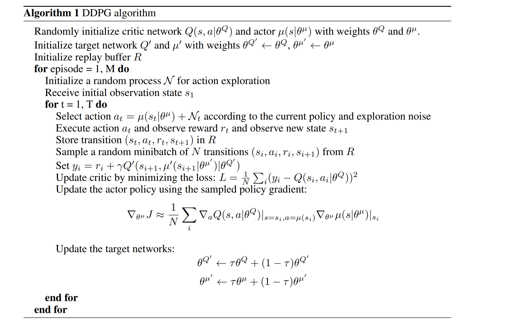
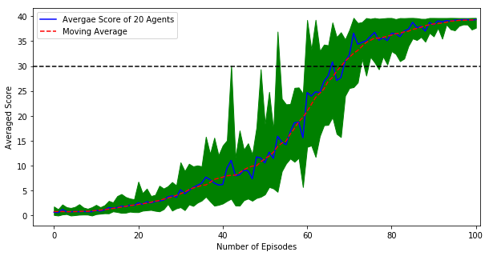
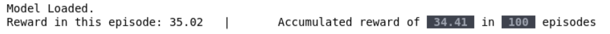

[//]: # (Image References)

[image3]: https://user-images.githubusercontent.com/10624937/43851024-320ba930-9aff-11e8-8493-ee547c6af349.gif "Trained Agent"

# Deep Reinforcement Learning: Project 2 - Continuous Control

![Trained Agent][image3]

## Getting started
Please click and follow [these instructions](https://github.com/udacity/deep-reinforcement-learning/tree/master/p2_continuous-control#getting-started).

## Source Code
All of the python components of the project are included in a single notebook:
* `continuous_control.ipynb`: contains all python code needed to train and play with the agent including:
    * Agent class
    * Neural Network Architecture definitions for actor/critic (model)
    * Replay Memory Class
    * Main Driver Class
    * Plotting and reporting calls 

Apart from the source code the following files are necessary and hence are included with the project:
* `checkpoint_actor.pth`: The trained actor network, necessary for scoring an environment.
* `checkpoint_critic.pth`: The trained critic network, necessary for scoring an environment.
* `./env/Reacher_Linux_parallel/Reacher.x86_64*`: The linux version of the Unity's Reacher environment on which the agent is trained.

The [DDPG-pendulum](https://github.com/udacity/deep-reinforcement-learning/tree/master/ddpg-pendulum) practice project has been used as the starting point for completing project.

### Training Algorithm (DDPG)
I chose the DDPG algorithm for solving this environment. There are several components in the DDPG training algorithm:

1. **[DDPG](https://arxiv.org/pdf/1509.02971.pdf)** is inherently an actor-critic algorithm. In DDPG the actor is being trained to find the best action given a known state, and the critic is trained to predict an estimate of the score given a state-action pair. Several similarities can be drawn between DDPG and DQN. For instance similar to DQN, here each of actor and critic networks have local and target networks


[reference](https://arxiv.org/pdf/1509.02971.pdf)

2. **target network updates**: The target networks of the actor and critic are both updated using soft-updates.

3. **Replay Buffer**: *Experience tuples* `(S, A, R, S', done)` namely `state`, `action`, `reward`, `next_state` and `done` are gathered from multiple agents in batches with the defined size (identical to DQN). This buffer is used to train the agent by random sampling (area for improvement). The implementation is identical to what was provided in the [DDPG-pendulum](https://github.com/udacity/deep-reinforcement-learning/tree/master/ddpg-pendulum) practice project.

4. **Ornstein-Uhlenbeck noise**: This routine generates noise to incorporate exploration opportunity during the training process of local networks, an extremely effective technique for faster convergence.
    

### Network Architecture
A feedforward neural network with two hidden layers. 
* **Input Layer**:   Takes the current state of the Reacher environment, (vector of 33 elements).
* **layer 1 and 2**: Two hidden layers with 128 neurons each.
* **Output layer**:  The output layer computes the scores for each of the 4 possible actions.


## Hyperparameters
The following hyperparameters are used in the training process.

```python
BUFFER_SIZE  = int(1e6)  # replay buffer size
BATCH_SIZE   = 128       # minibatch size
GAMMA        = 0.99      # discount factor
TAU          = 1e-3      # for soft update of target parameters
LR_ACTOR     = 1e-4      # learning rate of the actor 
LR_CRITIC    = 1e-4      # learning rate of the critic
WEIGHT_DECAY = 0         # L2 weight decay
```


## How to train the model
Open the `continuous_control.ipynb` notebook and run the first cell till the end of "Train and Serialize the network".
To train the model on the GPU, uncomment the following line in the "Hyperparameters" cell:

        device = torch.device("cuda:0" if torch.cuda.is_available() else "cpu")

## Training performance
After training the model, run the "Training performance" to visualize the history of the scores as the learning proceeds.



It can be observed that the superimposed moving average of the scores is increasing monotonically, proving the constant improvement of the agent.
The agents (on average) achieve the target score of 30 after 74 episodes and on average score 39.18 after 100 episodes.

### Play the agent
To evaluate the performance of the trained agent, run the "Watch the agent play and evaluate its performance" cell.
Note that this cell does not require a training step and can be tried at anytime. The serialized trained networks, `checkpoint_actor.pth` and, `checkpoint_critic.pth` are provided in the repository.
You can watch the agent try 100 different episodes and the progress-bar update as different episodes are played.  



The final score of 34.0 and above is constantly obtained for 100 episodes which achieves the objective of the project.
Here is an animation of the trained networks on Unity's Reacher environment:


## Future Work
The following areas of are to be explored.

* **A3C vs. DDPG**: Comparing the performance of DDPG vs. A3C.

* **PPO/TRPO/D4PG vs. DDPG**: Comparing the performance of DDPG vs. more robust algorithms such as TRPO, PPO, D4PG.

* **Buffer Prioritization**: Smart use of the buffer and prioritizing the rare and important events with non-uniform sampling.

* **[Crawler](https://github.com/Unity-Technologies/ml-agents/blob/master/docs/Learning-Environment-Examples.md#crawler)**: Solving the Crawler problem using DDPG.

