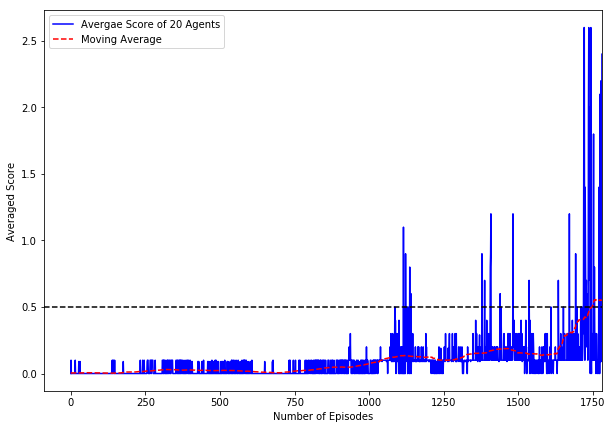

[//]: # (Image References)

[image1]: https://user-images.githubusercontent.com/10624937/42135623-e770e354-7d12-11e8-998d-29fc74429ca2.gif "Trained Agent"

# Deep Reinforcement Learning: Project 3: Collaboration and Competition

![Trained Agent][image1]

## Environment: Getting started
Please click and follow [these instructions](https://github.com/udacity/deep-reinforcement-learning/tree/master/p3_collab-compet) to get started on this environment.

## Source Code
All of the python components of the project are included in a single jupyter notebook:
* `collab_compet.ipynb`: contains all python code needed to train and play with the agent including (listed in order found in the notebook):
    * Tuned Hyperparameters           
    * Actor/Critic NNs (models):       `Actor` and `Critic`
    * Replay Memory Class:             `ReplayBuffer`
    * Ornstein-Uhlenbeck noise Class:  `OUNoise`
    * DDPG Agent:                      `ddpg` - the agent representing each player
    * Multi Agent DDPG Class:          `multi_agent_ddpg`: the class that initiates and trains multiple `ddpg` agents in the environment.
    * Tennis Player Class :            `tennis_player_maddpg` a wrapper class for training and playing the tennis player game.
    * Plotting and reporting calls:    last two cells in the notebook

Apart from the source code the following files are necessary, hence are included with the project:
* `actor_agent_{i}.pth` where i=0,1:  The trained actor network for each of the two agents, necessary for scoring an environment.
* `critic_agent_{i}.pth` where i=0,1: The trained critic network for each of the two agents, necessary for scoring an environment.
* `./env/Tennis_Linux/Tennis.x86_64*`: The linux version of the Unity's Tennis environment on which the agents are trained.

The [DDPG-pendulum](https://github.com/udacity/deep-reinforcement-learning/tree/master/ddpg-pendulum) practice project has been used as the starting point for completing this project.

### Training Algorithm (MADDPG)
Multi Agent Deep Deterministic Policy Gradient algorithm (MADDPG) is used for solving this environment. The principles of the MADDPG is based on DDPG with clever modifications to make multi-agent learning possible.
There are several components in the DDPG training algorithm:

and is identical to what I have already reported [here in project 2](https://github.com/adehgha/Deep_RL_Projects/tree/master/project%202-continuous_control).

1. **[DDPG](https://arxiv.org/pdf/1509.02971.pdf)** is inherently an actor-critic algorithm. In DDPG the actor is being trained to find the best action given a known state, and the critic is trained to predict an estimate of the score given a state-action pair. Several similarities can be drawn between DDPG and DQN. For instance similar to DQN, actor and critic networks have local and target networks. It however differs from DQN since the critic is used to approximate the maximum Q-values. MADDPG is simply multiple DDPG agent that all learn from a joint replay buffer. Each agent has its own local and target actor/critic networks that are trained.

2. Two **Actor Networks**, each with local and target networks. The actor networks generally map states to actions.

3. Two **Critic Networks**, each with local and target networks. The critic networks estimate the Q-values from state-action pairs.

5. **Replay Buffer**: *Experience tuples* `(S, A, R, S', done)` namely `state`, `action`, `reward`, `next_state` and `done` are gathered from multiple agents (2 in this case) in batches with the defined size (identical to DQN). This joint buffer is used to train both agents by random sampling (area for improvement). The implementation is identical to what was provided in the [DDPG-pendulum](https://github.com/udacity/deep-reinforcement-learning/tree/master/ddpg-pendulum) practice project.

6. **Ornstein-Uhlenbeck noise**: This routine generates noise to incorporate exploration opportunity during the training process of local networks, an extremely effective technique for faster convergence. The noise is disabled towards the end of training for faster convergence.
    

### Network Architecture
A feedforward neural network with two hidden layers. 
* **Input Layer**:   Takes the current state of the environment, (vector of 8 elements).
* **layer 1 and 2**: Two hidden layers with 256 neurons each.
* **Output layer**:  The output layer computes the scores for each of the 2 possible actions (movement and jumping).


## Hyperparameters
The following hyperparameters are used in the training process.

```python
BUFFER_SIZE  = int(1e4)  # replay buffer size
BATCH_SIZE   = 128 * 2   # minibatch size
GAMMA        = 1.0       # discount factor
TAU          = 1e-3      # for soft update of target parameters
LR_ACTOR     = 1e-4      # learning rate of the actor 
LR_CRITIC    = 1e-3      # learning rate of the critic
WEIGHT_DECAY = 0         # L2 weight decay
```
The hyperparameters are tuned in a non-systematic way. The following observation are noteworthy.
* **GAMMA**: Faster and more reliable training was observed when I eliminated discount factor i.e. GAMMA=1.
* **LR_ACTOR**: For the chosen architecture, smaller learning rate for the actor networks leads to faster convergence (1e-4).
* **LR_CRITIC**: The critic network learns faster and can use larger learning rates (1e-3) for faster convergence.

## How to train the model
Open the `collab_compet.ipynb` notebook and run all cells from the beginning till the end of "Train and Serialize the Trained Agents".
To train the model on the GPU, uncomment the following line in the "Hyperparameters" cell:

        device = torch.device("cuda:0" if torch.cuda.is_available() else "cpu")

## Training performance
After training the model, run the "Training performance" to visualize the history of the scores as the learning proceeds.



It can be observed that the superimposed moving average of the scores does not follow a clear trend until around episode=1100. It then starts to increase gradually demonstrating the intermittent but consistent improvement of the agent along with good exploration of the solution space (using the induced noise).
The agents (on average) achieve the target score of **0.5 after 1781 episodes** and on average score 0513 in the last 100 episodes.

### Play the agent
To watch the trained agents play, you must run all cells in the provided notebook **except** the cell titled: "Train and Serialize the Trained Agents".
Note that this cell does not require a training step and can be tried at anytime. The serialized trained networks, `actor_agent_0.pth`, `actor_agent_1.pth`, `critic_agent_0.pth` and, `critic_agent_1.pth` are provided in the repository.
You can changed the number of episodes played by changing the `n_episodes`.
The following animation is obtained from playing the trained agents.


## Future Work
The following areas of are to be explored.

* **Systematic Hyperparameter Tuning**: Using robust optimization techniques (e.g. black box) to find the optimal hyperparameters.

* **PPO vs. MADDPG**: Comparing the performance of MADDPG vs. more robust algorithms such as PPO/TRPO.

* **Experience Prioritization**: Smart use of the buffer and prioritizing the rare and important events with non-uniform sampling.

* **[Soccer Environment](https://github.com/udacity/deep-reinforcement-learning/tree/master/p3_collab-compet#optional-challenge-crawler-environment)**: Solving the Soccer environment with 4 agents using MADDPG.

